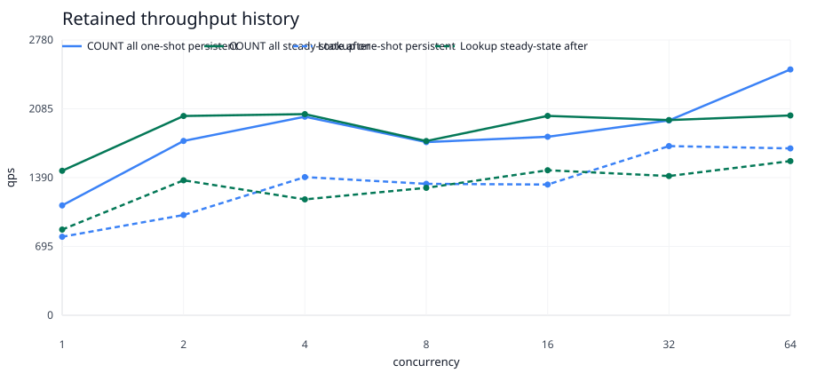
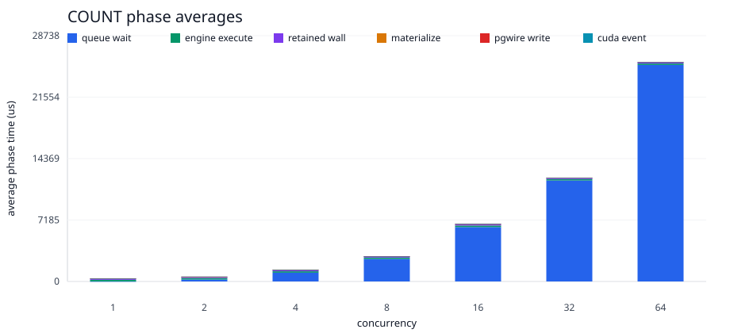
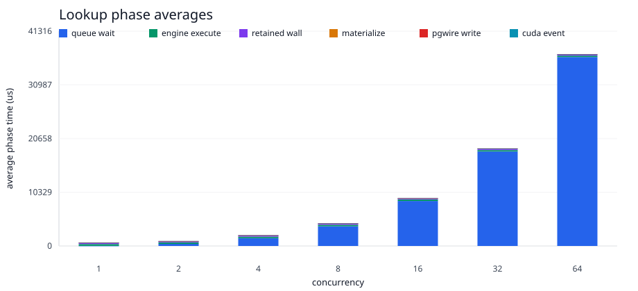

# RTX 6000 Pro Calibration Baseline

- stream: benchmark
- round_id: 2026-06-11-rtx6000-pro-calibration-v1
- status: closed
- hardware: NVIDIA RTX PRO 6000 Blackwell Max-Q Workstation Edition
- driver: 595.71.05
- cuda_runtime_reported_by_nvidia_smi: 13.2
- memory: 97887 MiB
- next_target: owner_thread_serial_request_execution_boundary
- bounded_gpu_artifact: target/rtx6000-pro-calibration/p8-steady-state-pgwire-response-baseline/engine-backed-pgwire-concurrency-smoke/engine-backed-pgwire-concurrency-smoke.md
- identical_pgwire_artifact: target/rtx6000-pro-calibration/identical-pgwire-target-smoke/identical-pgwire-target-smoke/identical-pgwire-target-smoke.md
- graph_assets: docs/testing/reports/series/p8-retained-concurrency/assets/2026-06-11-rtx6000-pro-calibration-v1-assets/

## Result

The new RTX 6000 Pro-class GPU is installed and healthy for the local CUDA
runtime path. The CUDA parity smoke passed on the new card:

- `gpu_db_execution` CUDA runtime tests: 13 passed, 0 failed.
- `gpu_db_engine` CUDA MVCC tests: 38 passed, 0 failed.

The P8 pgwire endpoint examples also still compile:

- `cargo check -q -p gpu_db_engine --example p8_engine_pgwire_benchmark_endpoint`
- `cargo check -q -p gpu_db_engine --example p8_persistent_pgwire_concurrency_runner`

The bounded steady-state retained-route benchmark was rerun without changing
the workload shape from the prior response-path round: 64 SQL-visible rows,
concurrency `1,2,4,8,16,32,64`, one warmup request per persistent session, and
eight measured requests per session.

The outcome preserves the previous diagnosis. The new GPU does not move the
dominant c64 latency because the measured boundary is still owner-thread /
pgwire scheduling queue wait, not retained CUDA execution.

## Visual Evidence

The graph-ready CSV and SVGs are checked in under
`series/p8-retained-concurrency/assets/2026-06-11-rtx6000-pro-calibration-v1-assets/`.








## Hardware Capture

The local device capture reported:

```text
GPU 0: NVIDIA RTX PRO 6000 Blackwell Max-Q Workstation Edition
Driver Version: 595.71.05
CUDA Version: 13.2
Memory: 97887 MiB
Bus: 00000000:C1:00.0
Power cap: 300 W
MIG: N/A
```

The environment report and CUDA parity log are included in the asset directory:

- `cuda-environment.txt`
- `cuda-parity.log`

## Steady-State GPU DB Baseline

At concurrency `64`, retained route execution remained microsecond-scale while
queue wait dominated visible request latency.

| query | measured requests | p50 us | p95 us | throughput qps | queue avg us | queue max us | engine avg us | retained wall avg us | materialize avg us | pgwire write avg us | CUDA event avg us | errors |
| --- | ---: | ---: | ---: | ---: | ---: | ---: | ---: | ---: | ---: | ---: | ---: | ---: |
| `COUNT(*)` | 512 | 25789 | 28152 | 2155.517198 | 25318 | 29627 | 170 | 149 | 3 | 9 | 10 | 0 |
| `ol_o_id` multi-column lookup | 512 | 37927 | 39673 | 1496.708411 | 36338 | 42397 | 286 | 239 | 5 | 11 | 10 | 0 |

Compared with the prior closed response-path round, the shape is effectively
unchanged: c64 latency scales with the serialized owner-thread queue, while
engine execution, retained wall time, materialization, client write, and CUDA
event timing remain far below the visible request latency.

The checked artifacts are:

- `engine-backed-pgwire-concurrency-curve.csv`
- `engine-backed-pgwire-metrics.jsonl`
- `steady-state-response-optimization-metrics.csv`

## PostgreSQL Parity Smoke

The identical pgwire target smoke was rerun at 64 rows and concurrency
`1,2,4,8,16,32,64` across:

- `default_postgresql`
- `tuned_postgresql`
- `gpu_db_retained_endpoint`

All targets used the same `psql`/libpq client boundary, same query schedule,
same graph-ready metric schema, and SQL-visible `CREATE TABLE` plus
`COPY FROM STDIN` load contract. The checked artifacts are:

- `identical-pgwire-target-concurrency-curve.csv`
- `identical-pgwire-target-metrics.jsonl`

At concurrency `64`, the scaled smoke showed:

| target/profile | query | p50 us | p95 us | throughput qps | errors |
| --- | --- | ---: | ---: | ---: | ---: |
| default PostgreSQL | `COUNT(*)` | 57725 | 69154 | 606.635071 | 0 |
| tuned PostgreSQL | `COUNT(*)` | 59058 | 66700 | 637.247093 | 0 |
| GPU DB retained endpoint | `COUNT(*)` | 42860 | 46113 | 734.205968 | 0 |
| default PostgreSQL | `ol_o_id` lookup | 57288 | 62917 | 644.388284 | 0 |
| tuned PostgreSQL | `ol_o_id` lookup | 59005 | 65326 | 635.639513 | 0 |
| GPU DB retained endpoint | `ol_o_id` lookup | 54171 | 62075 | 637.209024 | 0 |
| default PostgreSQL | composite/text lookup | 60323 | 64927 | 639.264845 | 0 |
| tuned PostgreSQL | composite/text lookup | 59086 | 65753 | 627.291083 | 0 |
| GPU DB retained endpoint | composite/text lookup | 48914 | 58850 | 651.180774 | 0 |

This remains a scaled smoke, not the full 25% product curve. Full default
PostgreSQL, tuned PostgreSQL, and GPU DB retained curves still require an
operator-approved long-run window.

## Decision

The installed GPU is validated, but the hardware change does not invalidate the
prior next blocker. The next implementation slice should integrate the
research-backed Candidate A/E runtime discipline at the measured boundary:

- bounded owner-thread draining
- explicit queue/admission credits
- response scheduling separation
- continued phase telemetry around queue wait, engine execution, retained wall
  time, CUDA event time, D2H bytes, materialization, and client write time

Direct WAL-to-GPU ingest, partition-owner over-residency, and broader tiering
work should stay behind later proof gates. They do not address the currently
measured bottleneck.

## Validation

- `nvidia-smi`
- `CUDA_PARITY_OUT_DIR=target/rtx6000-pro-calibration/cuda-parity timeout 900 scripts/run_cuda_parity.sh`
- `cargo check -q -p gpu_db_engine --example p8_engine_pgwire_benchmark_endpoint`
- `cargo check -q -p gpu_db_engine --example p8_persistent_pgwire_concurrency_runner`
- `GPU_DB_CH_BENCH_ENGINE_PGWIRE_ROWS=64 GPU_DB_CH_BENCH_ENGINE_PGWIRE_CONCURRENCY_TARGETS=1,2,4,8,16,32,64 GPU_DB_CH_BENCH_ENGINE_PGWIRE_PORT=55452 GPU_DB_CH_BENCH_PERSISTENT_REQUESTS_PER_CLIENT=8 GPU_DB_CH_BENCH_PERSISTENT_WARMUP_REQUESTS_PER_CLIENT=1 GPU_DB_CH_BENCH_OUT_DIR=target/rtx6000-pro-calibration/p8-steady-state-pgwire-response-baseline timeout 1800 scripts/run_p8_ch_benchmark_residency_probe.sh --engine-backed-pgwire-concurrency-smoke`
- `GPU_DB_CH_BENCH_OUT_DIR=target/rtx6000-pro-calibration/identical-pgwire-target-smoke GPU_DB_CH_BENCH_IDENTICAL_PGWIRE_ROWS=64 GPU_DB_CH_BENCH_IDENTICAL_PGWIRE_CONCURRENCY_TARGETS=1,2,4,8,16,32,64 GPU_DB_CH_BENCH_IDENTICAL_PGWIRE_PORT=55466 GPU_DB_CH_BENCH_PGSQL_DOCKER_PORT=55467 timeout 1800 scripts/run_p8_ch_benchmark_residency_probe.sh --identical-pgwire-target-smoke`
- `GPU_DB_P8_RETAINED_HISTORY_SERIES=rtx6000_pro_baseline GPU_DB_P8_RETAINED_PHASE_SERIES=rtx6000_pro_baseline python3 scripts/render_p8_retained_concurrency_history.py docs/testing/reports/series/p8-retained-concurrency/assets/2026-06-02-p8-steady-state-pgwire-response-optimization-graphs-v1-assets/steady-state-response-optimization-metrics.csv target/rtx6000-pro-calibration/p8-steady-state-pgwire-response-baseline/engine-backed-pgwire-concurrency-smoke/metrics.jsonl target/rtx6000-pro-calibration/p8-steady-state-pgwire-response-baseline/assets`

No 25%, 125%, full 10% reload, concurrency `128`, broad benchmark-tier command,
or code optimization was run in this calibration slice.
