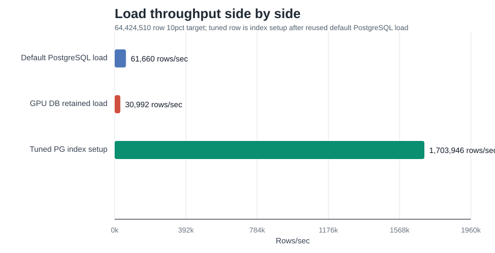
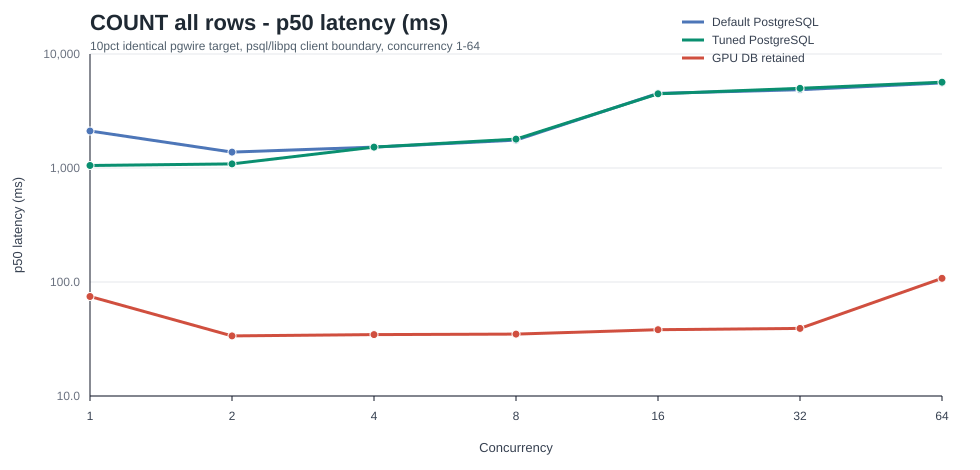
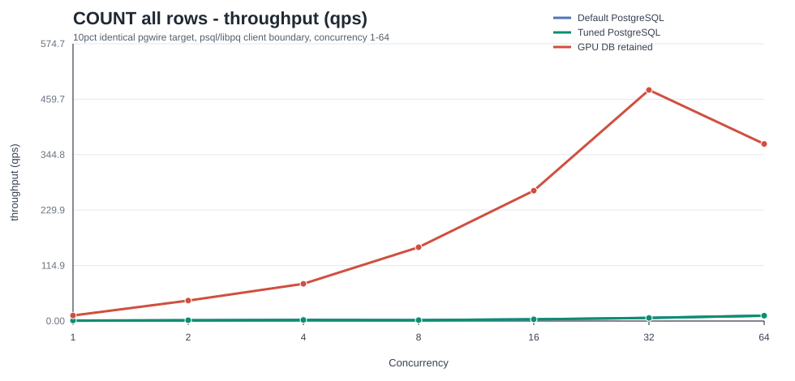
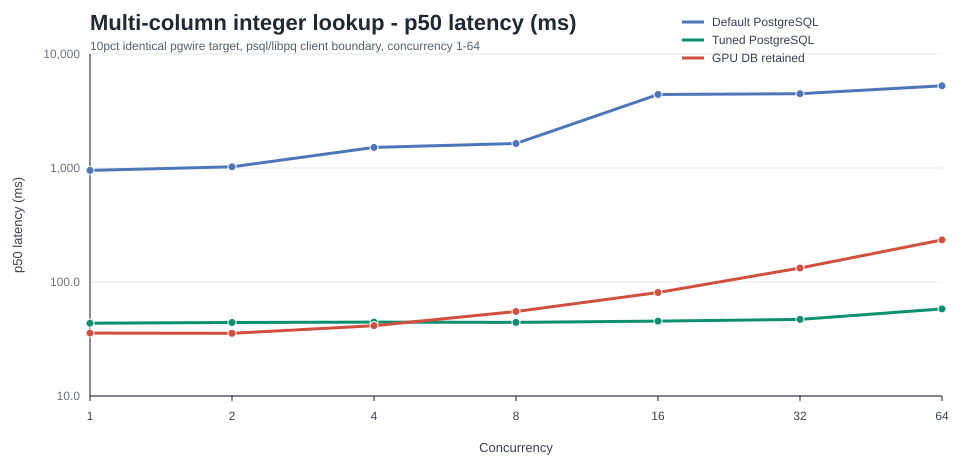
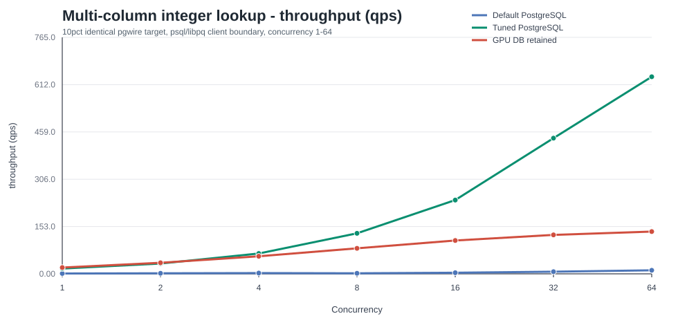
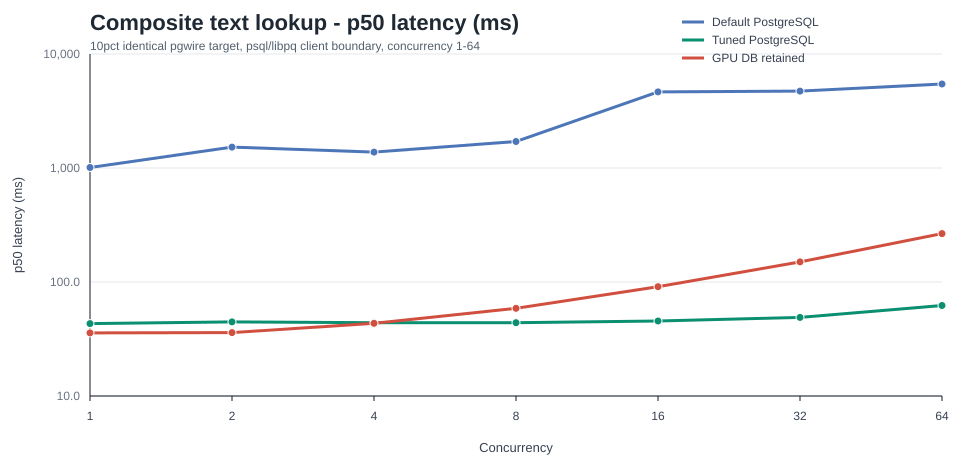
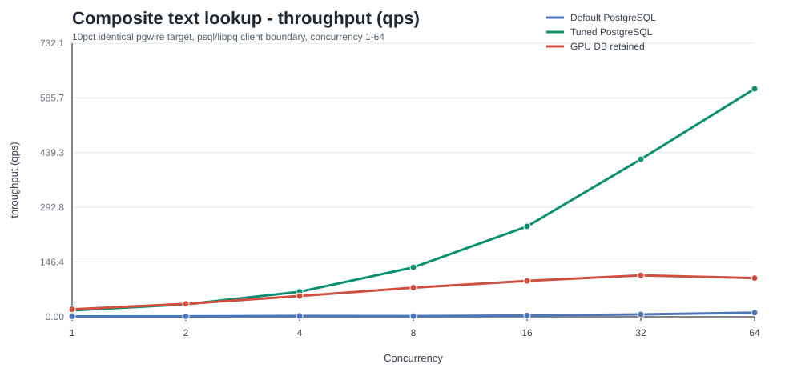

# P8 Identical 10pct Execution v4

- Round: `2026-06-02-p8-identical-10pct-execution-v4`
- Status: `closed`
- Git SHA: `3752a86e`
- Command exit: `0`
- Output directory: `target/p8-identical-10pct-execution-v4`
- Metrics: `target/p8-identical-10pct-execution-v4/identical-pgwire-target-smoke/metrics.jsonl`
- Endpoint facts: `target/p8-identical-10pct-execution-v4/identical-pgwire-target-smoke/endpoint-facts.txt`
- Curve artifact: `target/p8-identical-10pct-execution-v4/identical-pgwire-target-smoke/concurrency-curve.csv`
- Command log: `target/p8-identical-10pct-execution-v4-command.log`
- Visual comparison assets: `docs/testing/reports/2026-06-02-p8-identical-10pct-execution-v4-assets/`
- Cleanup status: `clean`
- Next blocker: `none`

The 10pct identical pgwire target smoke closed through the real `psql`/libpq path with target rows `64,424,510` and concurrency targets `1,2,4,8,16,32,64`. No 25pct, 125pct, or 128-client rows were run.

## Load Evidence

```jsonl
{"kind":"identical_pgwire_target_load_metric","tier":"10pct","target":"default_postgresql","profile":"default_postgresql","phase":"load","rows_loaded":64424510,"elapsed_ms":1044825,"rows_per_sec":61660,"status":"pass","gpu_copy_minimum_rows_per_sec":30000,"gpu_copy_minimum_met":null,"artifact_out":"target/p8-identical-10pct-execution-v4/identical-pgwire-target-smoke/default-postgresql-load.out","artifact_err":"target/p8-identical-10pct-execution-v4/identical-pgwire-target-smoke/default-postgresql-load.err"}
{"kind":"identical_pgwire_target_load_metric","tier":"10pct","target":"gpu_db_retained_endpoint","profile":"gpu_db_retained_endpoint","phase":"load","rows_loaded":64424510,"elapsed_ms":2078721,"rows_per_sec":30992,"status":"pass","gpu_copy_minimum_rows_per_sec":30000,"gpu_copy_minimum_met":true,"artifact_out":"target/p8-identical-10pct-execution-v4/identical-pgwire-target-smoke/gpu-db-load.out","artifact_err":"target/p8-identical-10pct-execution-v4/identical-pgwire-target-smoke/gpu-db-load.err"}
{"kind":"identical_pgwire_target_load_metric","tier":"10pct","target":"tuned_postgresql","profile":"tuned_postgresql","phase":"load_reused","rows_loaded":64424510,"elapsed_ms":0,"rows_per_sec":0,"status":"pass","gpu_copy_minimum_rows_per_sec":30000,"gpu_copy_minimum_met":null,"artifact_out":"target/p8-identical-10pct-execution-v4/identical-pgwire-target-smoke/default-postgresql-load.out","artifact_err":"target/p8-identical-10pct-execution-v4/identical-pgwire-target-smoke/default-postgresql-load.err"}
{"kind":"identical_pgwire_target_load_metric","tier":"10pct","target":"tuned_postgresql","profile":"tuned_postgresql","phase":"setup","rows_loaded":64424510,"elapsed_ms":37809,"rows_per_sec":1703946,"status":"pass","gpu_copy_minimum_rows_per_sec":30000,"gpu_copy_minimum_met":null,"artifact_out":"target/p8-identical-10pct-execution-v4/identical-pgwire-target-smoke/tuned-postgresql.out","artifact_err":"target/p8-identical-10pct-execution-v4/identical-pgwire-target-smoke/tuned-postgresql.err"}
```

GPU DB retained endpoint met Richard's `>=30,000 rows/sec` COPY gate at `30,992 rows/sec`. Endpoint facts recorded `copy_rows_decoded_by_protocol=64424510`, `resident_admission_from_sql_visible_rows=true`, `sql_visible_resident_row_count=64424510`, `sql_visible_resident_device_memory_retained=true`, `copy_streaming_bounded_chunks=true`, `copy_committed_chunks=7865`, and `copy_max_buffered_decoded_rows=8192`.



## Query Evidence

Default PostgreSQL, tuned PostgreSQL, and GPU DB retained endpoint query rows all used the same `psql`/libpq client boundary, the same query schedule, the same concurrency schedule, and the same metric schema. All query rows returned `error_count=0`, `correctness_status=pass`.

The graph-ready side-by-side CSV is checked in at `docs/testing/reports/2026-06-02-p8-identical-10pct-execution-v4-assets/query-side-by-side.csv`.

### Visual Query Comparison













### GPU Retained Endpoint Detail

```text
query	concurrency	p50_us	p95_us	p99_us	throughput_qps	route
order_line_count_all	1	74537	74537	74537	11.373200	retained_engine_count_all
order_line_lookup_ol_o_id_multi_column	1	35641	35641	35641	20.435689	retained_engine_int4_equality_multi_column_projection
order_line_lookup_composite_text	1	35754	35754	35754	20.222856	retained_engine_int4_text_composite_equality_projection
order_line_count_all	2	33687	33690	33690	42.313714	retained_engine_count_all
order_line_lookup_ol_o_id_multi_column	2	35459	41660	41660	35.810206	retained_engine_int4_equality_multi_column_projection
order_line_lookup_composite_text	2	36013	43352	43352	34.590107	retained_engine_int4_text_composite_equality_projection
order_line_count_all	4	34536	37042	37042	77.151564	retained_engine_count_all
order_line_lookup_ol_o_id_multi_column	4	41410	55937	55937	56.778663	retained_engine_int4_equality_multi_column_projection
order_line_lookup_composite_text	4	43390	56731	56731	55.761564	retained_engine_int4_text_composite_equality_projection
order_line_count_all	8	34896	36312	36312	152.975371	retained_engine_count_all
order_line_lookup_ol_o_id_multi_column	8	55150	81203	81203	82.453826	retained_engine_int4_equality_multi_column_projection
order_line_lookup_composite_text	8	58782	86619	86619	77.997797	retained_engine_int4_text_composite_equality_projection
order_line_count_all	16	38162	42179	42179	270.224624	retained_engine_count_all
order_line_lookup_ol_o_id_multi_column	16	80843	129634	129634	107.840692	retained_engine_int4_equality_multi_column_projection
order_line_lookup_composite_text	16	90950	147702	147702	96.188530	retained_engine_int4_text_composite_equality_projection
order_line_count_all	32	39164	42469	43449	478.891366	retained_engine_count_all
order_line_lookup_ol_o_id_multi_column	32	132586	222039	230349	125.870770	retained_engine_int4_equality_multi_column_projection
order_line_lookup_composite_text	32	149942	255930	266215	110.879342	retained_engine_int4_text_composite_equality_projection
order_line_count_all	64	107693	138665	143637	366.959852	retained_engine_count_all
order_line_lookup_ol_o_id_multi_column	64	233919	412098	432569	136.591321	retained_engine_int4_equality_multi_column_projection
order_line_lookup_composite_text	64	265688	548156	581893	103.531726	retained_engine_int4_text_composite_equality_projection
```

Endpoint facts also recorded retained-route evidence for composite/text lookup: `client_visible_select_retained_route_accepted=true`, `client_visible_select_retained_route_zero_h2d=true`, `client_visible_select_retained_route_h2d_delta=0`, `client_visible_select_retained_route_d2h_delta=62`, and `client_visible_select_retained_match_index_compaction=true`.

## Decision

```json
{"kind":"identical_pgwire_target_decision","tier":"10pct","status":"closed","rows":64424510,"requested_concurrency_targets":"1,2,4,8,16,32,64","same_query_schedule":true,"same_metric_schema":true,"same_client_boundary":true,"gpu_copy_minimum_rows_per_sec":30000,"gpu_copy_load_rows_per_sec":30992,"gpu_copy_minimum_met":true,"retained_route_boolean_recorded":true,"composite_text_lookup_retained_route_recorded":true,"device_match_index_compaction":true,"next_blocker":"none","deferred_blockers":["missing_partitioned_over_resident_execution"]}
```

Final cleanup checks found no `.autoloop.lock`, no benchmark-owned PostgreSQL Docker container on the benchmark ports, and no live endpoint/`psql`/benchmark process. Two stale pre-run lock files were archived under `target/autoloop-stale-locks/` after wrapper heredoc bootstraps failed before starting the benchmark; the actual benchmark ran once under a fresh lock.
