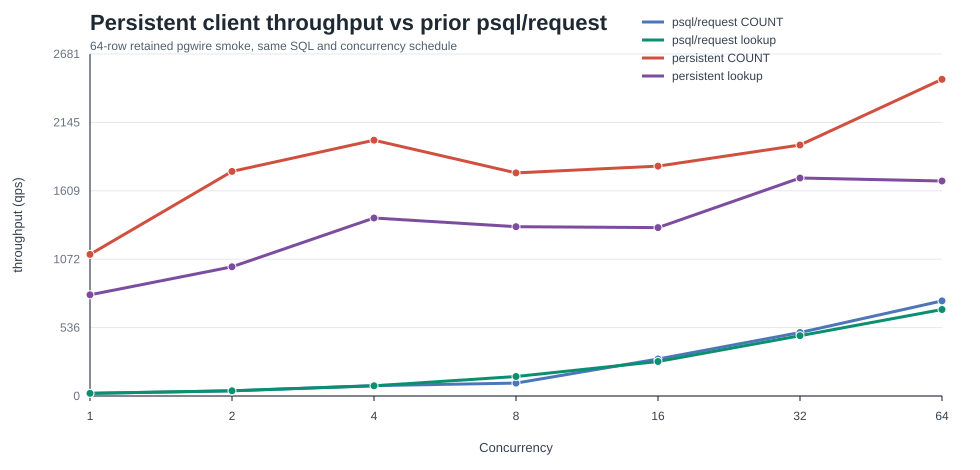
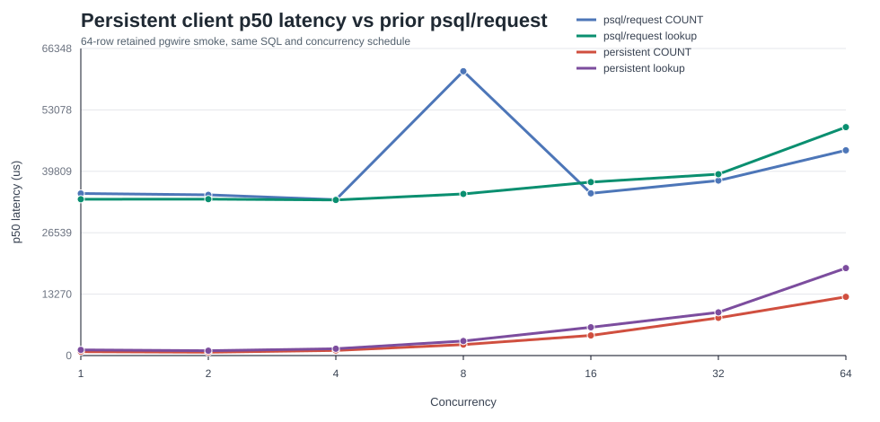
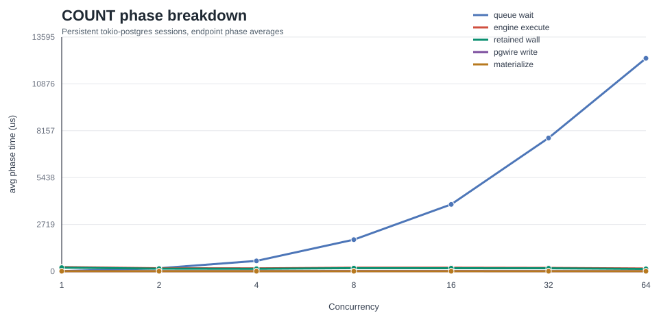
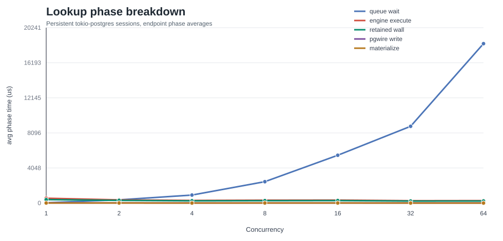

# P8 Persistent Client Concurrency Measurement

- stream: benchmark
- round_id: 2026-06-02-p8-persistent-client-concurrency-measurement-graphs-v1
- status: closed
- next_target: client_harness_or_pgwire_response_path
- smoke_artifact: target/p8-persistent-client-concurrency-measurement-graphs-v1/engine-backed-pgwire-concurrency-smoke/engine-backed-pgwire-concurrency-smoke.md
- metrics_artifact: target/p8-persistent-client-concurrency-measurement-graphs-v1/engine-backed-pgwire-concurrency-smoke/metrics.jsonl
- curve_artifact: target/p8-persistent-client-concurrency-measurement-graphs-v1/engine-backed-pgwire-concurrency-smoke/concurrency-curve.csv
- graph_assets: docs/testing/reports/2026-06-02-p8-persistent-client-concurrency-measurement-graphs-v1-assets/

## Result

Added a bounded persistent PostgreSQL-compatible simple-query runner for the
engine-backed retained pgwire endpoint. The runner opens one
`tokio-postgres` session per concurrent client, synchronizes the clients, and
issues the same SQL used by the prior retained concurrency smoke without
forking one `psql` process per logical request.

The existing smoke now records the same metric schema for retained `COUNT(*)`
and retained multi-column int4 lookup through concurrency `1,2,4,8,16,32,64`.
The seed path remains SQL-visible `CREATE TABLE` plus `COPY FROM STDIN`, and
the endpoint phase aggregates still record scheduler queue wait, engine
execution, retained wall time, CUDA event time, D2H bytes, materialization, and
pgwire response write timing.

## Visual Evidence

The graph-ready CSV is checked in at
`docs/testing/reports/2026-06-02-p8-persistent-client-concurrency-measurement-graphs-v1-assets/persistent-client-concurrency-metrics.csv`.

## Evidence

The bounded persistent-client run used 64 SQL-visible rows and preserved the
prior query/concurrency schedule. At concurrency `64`:

| query | p50 us | p95 us | throughput qps | queue avg us | engine avg us | retained wall avg us | CUDA event avg us | D2H avg bytes | errors |
| --- | ---: | ---: | ---: | ---: | ---: | ---: | ---: | ---: | ---: |
| `COUNT(*)` | 12681 | 24223 | 2482.448315 | 12359 | 162 | 141 | 10 | 0 | 0 |
| `ol_o_id` multi-column lookup | 18894 | 35835 | 1685.496827 | 18401 | 286 | 238 | 11 | 40 | 0 |

Compared with the prior `psql`-per-request smoke at concurrency `64`, retained
`COUNT(*)` moved from `44351` us p50 / `745.746912` qps to `12681` us p50 /
`2482.448315` qps. The retained multi-column lookup moved from `49355` us p50 /
`677.808138` qps to `18894` us p50 / `1685.496827` qps.

## Decision

The persistent-client measurement removes the immediate per-request process
startup blocker and shows a cleaner retained endpoint signal. It still does not
justify retained scheduler batching in this slice: engine execution, retained
wall time, CUDA event time, result materialization, and pgwire write timing are
all microsecond-scale in the bounded profile, while the visible latency at
concurrency `64` is dominated by owner-thread queue wait from the synchronized
request burst.

The next target should be `client_harness_or_pgwire_response_path`: broaden the
persistent runner to steady-state repeated requests and, if that confirms queue
wait under real session reuse, then decide whether the endpoint owner-thread
scheduling path needs async response handling or batching. Do not change the GPU
retained scheduler before that steady-state client evidence exists.

## Validation

- `cargo check -q -p gpu_db_engine --example p8_persistent_pgwire_concurrency_runner`
- `bash -n scripts/run_p8_ch_benchmark_residency_probe.sh`
- `GPU_DB_CH_BENCH_ENGINE_PGWIRE_ROWS=64 GPU_DB_CH_BENCH_ENGINE_PGWIRE_CONCURRENCY_TARGETS=1,2,4,8,16,32,64 GPU_DB_CH_BENCH_ENGINE_PGWIRE_PORT=55451 GPU_DB_CH_BENCH_OUT_DIR=target/p8-persistent-client-concurrency-measurement-graphs-v1 scripts/run_p8_ch_benchmark_residency_probe.sh --engine-backed-pgwire-concurrency-smoke`

No 25pct, 125pct, full 10pct reload, concurrency `128`, broad benchmark-tier
command, or retained scheduler change was run for this slice.
