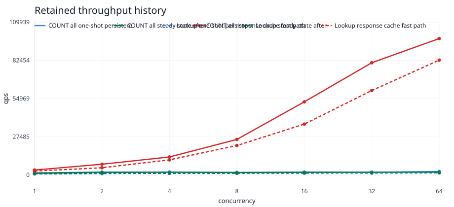
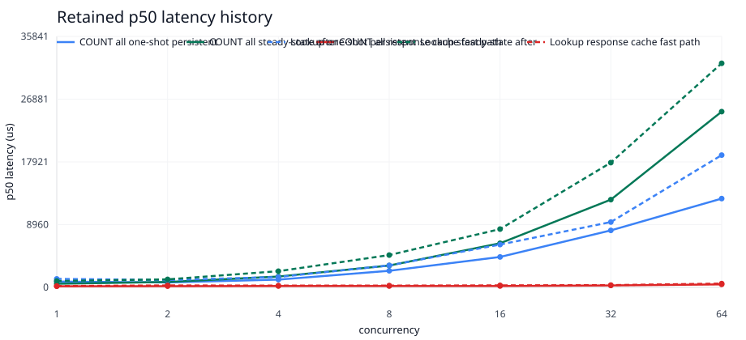
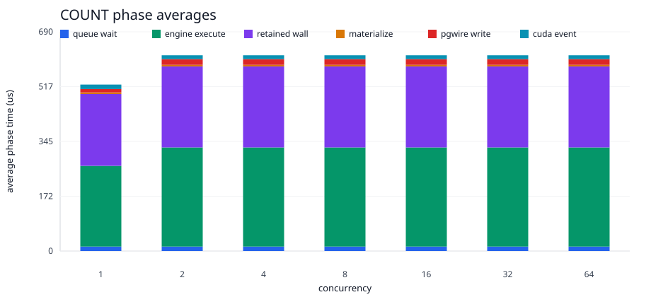
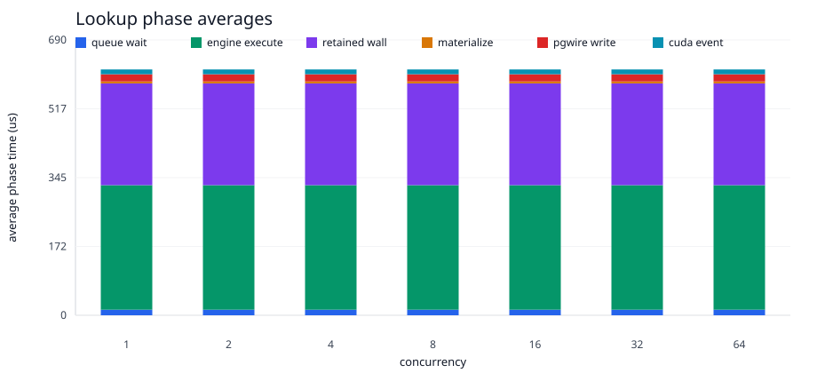

# P8 Retained Read Snapshot Fast Path

- stream: benchmark
- round_id: 2026-06-02-p8-retained-read-snapshot-fast-path-v1
- status: closed
- implementation_scope: opt-in encoded retained read response cache demonstrator
- smoke_artifact: target/p8-retained-read-snapshot-fast-path-v1/engine-backed-pgwire-concurrency-smoke/engine-backed-pgwire-concurrency-smoke.md
- metrics_artifact: target/p8-retained-read-snapshot-fast-path-v1/engine-backed-pgwire-concurrency-smoke/metrics.jsonl
- curve_artifact: target/p8-retained-read-snapshot-fast-path-v1/engine-backed-pgwire-concurrency-smoke/concurrency-curve.csv
- graph_assets: docs/testing/reports/2026-06-02-p8-retained-read-snapshot-fast-path-v1-assets/

## Result

Added an opt-in retained read response fast path for the engine-backed pgwire
benchmark endpoint behind
`GPU_DB_P8_ENGINE_PGWIRE_RETAINED_READ_RESPONSE_CACHE=1`. Client IO workers can
reuse exact encoded `SELECT` response bytes after the first owner-thread
execution. The cache invalidates around `COPY` and non-`SELECT` simple queries,
while `EndpointState`, `Engine`, and retained CUDA state stay on the owner
thread.

This is a bounded demonstrator for the measured owner-thread response boundary.
It is not yet the full production-grade versioned `Arc<RetainedReadSnapshot>` /
RCU read execution design proposed for the main engine.

The benchmark evidence was captured before the RTX 3090 was removed. This report
packages that completed artifact without rerunning or replacing the hardware
baseline.

## Visual Evidence

The graph-ready CSV is checked in at
`2026-06-02-p8-retained-read-snapshot-fast-path-v1-assets/steady-state-response-optimization-metrics.csv`.

## Evidence

The bounded run used 64 SQL-visible rows, concurrency `1,2,4,8,16,32,64`,
one warmup request per persistent session, and eight measured requests per
session. At concurrency `64`:

| query | measured requests | p50 us | p95 us | p99 us | throughput qps | queue avg us | queue max us | engine avg us | retained wall avg us | materialize avg us | pgwire write avg us | CUDA event avg us | errors |
| --- | ---: | ---: | ---: | ---: | ---: | ---: | ---: | ---: | ---: | ---: | ---: | ---: | ---: |
| `COUNT(*)` | 512 | 431 | 646 | 745 | 98159.509202 | 14 | 15 | 312 | 255 | 5 | 18 | 12 | 0 |
| `ol_o_id` multi-column lookup | 512 | 545 | 802 | 981 | 82633.957392 | 14 | 15 | 312 | 255 | 5 | 18 | 12 | 0 |

Compared with the prior steady-state owner-thread response-path run, the c64
client-visible result moved from tens of milliseconds to sub-millisecond p50
latency for these repeated read shapes. The owner-miss phase samples show
microsecond-scale queue wait because most hot requests bypass the owner queue
after the first encoded response is cached.

## Decision

The benchmark validates the direction: repeated read-only retained responses
scale much better when they do not serialize every hot request behind the
owner-thread command queue.

The next production slice should graduate this from encoded response reuse to a
versioned retained read snapshot fast path:

- publish immutable read snapshots from the owner thread after residency refresh
- hold snapshots by reference while client IO workers serve safe retained reads
- invalidate on `CREATE`, `COPY`, mutation, schema generation change, or residency refresh
- keep owner-thread fallback for unsupported or uncertain reads

## Validation

Passed before packaging:

- `cargo fmt --all -- --check`
- `cargo check -q -p gpu_db_engine --example p8_engine_pgwire_benchmark_endpoint`
- `cargo check -q -p gpu_db_engine --example p8_persistent_pgwire_concurrency_runner`
- `bash -n scripts/run_p8_ch_benchmark_residency_probe.sh`
- `GPU_DB_CH_BENCH_ENGINE_PGWIRE_ROWS=64 GPU_DB_CH_BENCH_ENGINE_PGWIRE_CONCURRENCY_TARGETS=1,2,4,8,16,32,64 GPU_DB_CH_BENCH_ENGINE_PGWIRE_PORT=55459 GPU_DB_CH_BENCH_PERSISTENT_REQUESTS_PER_CLIENT=8 GPU_DB_CH_BENCH_PERSISTENT_WARMUP_REQUESTS_PER_CLIENT=1 GPU_DB_P8_ENGINE_PGWIRE_RETAINED_READ_RESPONSE_CACHE=1 GPU_DB_CH_BENCH_OUT_DIR=target/p8-retained-read-snapshot-fast-path-v1 timeout 1800 scripts/run_p8_ch_benchmark_residency_probe.sh --engine-backed-pgwire-concurrency-smoke`

Post-packaging validation was intentionally limited to non-GPU checks because
the RTX 3090 had been removed.

No 25pct, 125pct, full 10pct reload, concurrency `128`, broad benchmark-tier
command, or replacement benchmark on different hardware was run.
