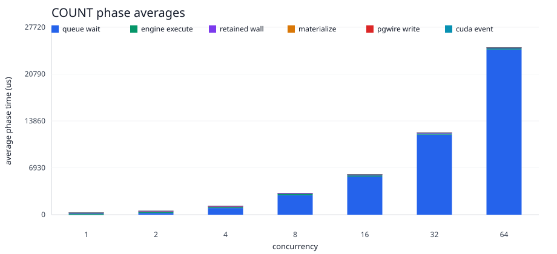
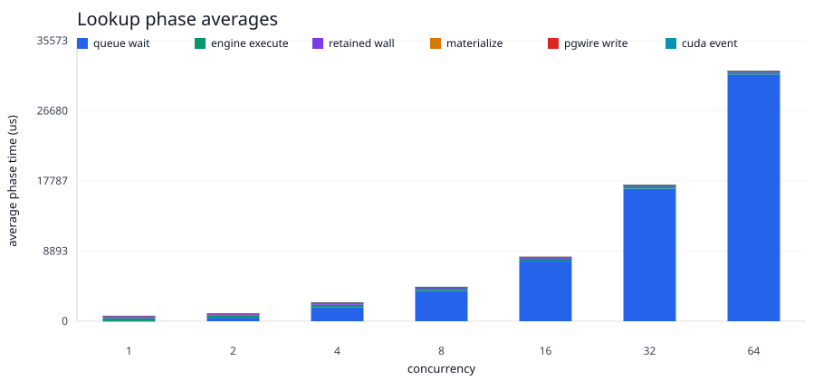

# P8 Retained Concurrency Improvement History

This page preserves the retained-route visual history without overwriting older
graph assets. Future rounds should append new asset directories and keep the
older links intact.

## Graph Asset History

| round | asset directory | notes |
| --- | --- | --- |
| `2026-06-02-p8-identical-10pct-execution-v4` | `2026-06-02-p8-identical-10pct-execution-v4-assets/` | identical pgwire 10pct PostgreSQL/GPU side-by-side query graphs |
| `2026-06-02-p8-concurrency-pipeline-profile-batched-retained-scheduler-v1` | report plus target artifacts | psql-per-request phase profile; no before/after scheduler graphs because process launch dominated |
| `2026-06-02-p8-persistent-client-concurrency-measurement-graphs-v1` | `2026-06-02-p8-persistent-client-concurrency-measurement-graphs-v1-assets/` | persistent-client one-shot throughput, p50 latency, and phase graphs |
| `2026-06-02-p8-steady-state-pgwire-response-optimization-graphs-v1` | `2026-06-02-p8-steady-state-pgwire-response-optimization-graphs-v1-assets/` | steady-state repeated-session metrics after response-path allocation cleanup |

## Current Overlay

