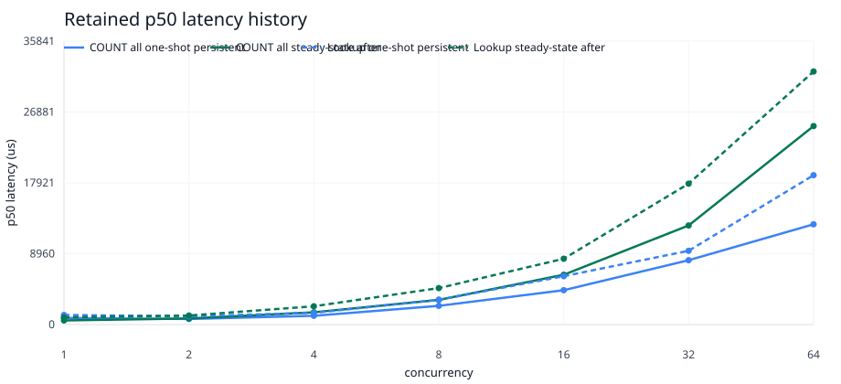
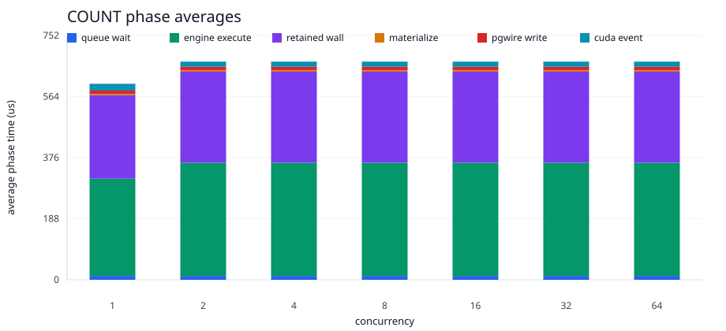
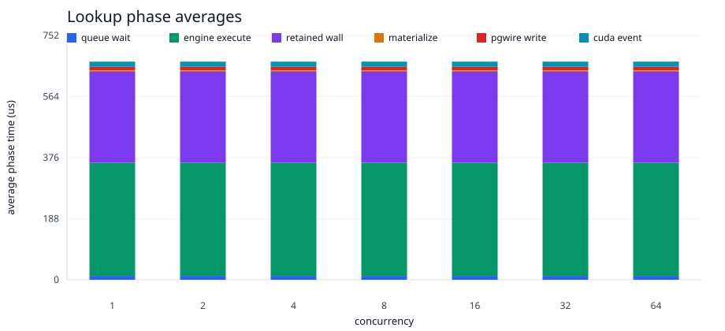

# P8 Retained Response Cache Default

- stream: benchmark
- round_id: 2026-06-11-retained-response-cache-default-v1
- status: closed
- optimization: default-enable retained-read response cache for the engine-backed pgwire benchmark endpoint
- previous_baseline: 2026-06-11-rtx6000-pro-calibration-v1
- next_target: response_cache_invalidation_and_route_aware_admission
- metrics_artifact: target/2026-06-11-retained-response-cache-default-v1/engine-backed-pgwire-concurrency-smoke/metrics.jsonl
- curve_artifact: target/2026-06-11-retained-response-cache-default-v1/engine-backed-pgwire-concurrency-smoke/concurrency-curve.csv
- graph_assets: docs/testing/reports/series/p8-retained-concurrency/assets/2026-06-11-retained-response-cache-default-v1-assets/

## Result

The engine-backed pgwire benchmark endpoint now defaults
`GPU_DB_P8_ENGINE_PGWIRE_RETAINED_READ_RESPONSE_CACHE` to enabled. The cache is
still explicitly controllable through the environment, and the cache remains
invalidated on SQL-visible mutation paths before new retained reads can be
served from cached response bytes.

This optimization targets the measured owner-thread / pgwire boundary for
repeated retained reads. The first request for a retained `SELECT` still enters
the owner thread, validates the retained route, executes against Engine
WAL/MVCC state, emits retained phase telemetry, and produces PostgreSQL wire
bytes. Repeated identical `SELECT` requests then reuse the cached response from
the client IO side instead of re-entering the owner-thread command queue.

No retained CUDA pointer ownership changed. `EndpointState`, `Engine`, and
retained CUDA memory remain owned by the endpoint owner thread.

## Visual Evidence

The graph-ready CSV and SVGs are checked in under
`series/p8-retained-concurrency/assets/2026-06-11-retained-response-cache-default-v1-assets/`.

## Evidence

The bounded steady-state run used the same RTX calibration workload: 64
SQL-visible rows, concurrency `1,2,4,8,16,32,64`, one warmup request per
persistent session, and eight measured requests per session.

At concurrency `64`:

| query | measured requests | p50 us | p95 us | p99 us | throughput qps | phase samples | queue avg us | engine avg us | retained wall avg us | CUDA event avg us | errors |
| --- | ---: | ---: | ---: | ---: | ---: | ---: | ---: | ---: | ---: | ---: | ---: |
| `COUNT(*)` | 512 | 378 | 530 | 598 | 113955.041175 | 2 | 12 | 348 | 280 | 16 | 0 |
| `ol_o_id` multi-column lookup | 512 | 455 | 740 | 855 | 93652.826047 | 2 | 12 | 348 | 280 | 16 | 0 |

The low `phase_samples` value is expected for this optimization: after the
first retained route validation and cache insertion, repeated identical reads
bypass the owner-thread retained execution path.

## Comparison To RTX Calibration

Compared with `2026-06-11-rtx6000-pro-calibration-v1` at concurrency `64`:

| query | baseline p50 us | current p50 us | baseline throughput qps | current throughput qps |
| --- | ---: | ---: | ---: | ---: |
| `COUNT(*)` | 25789 | 378 | 2155.517198 | 113955.041175 |
| `ol_o_id` multi-column lookup | 37927 | 455 | 1496.708411 | 93652.826047 |

This is a benchmark-endpoint fast path for repeated identical retained reads,
not a claim that arbitrary mixed SQL workloads no longer need owner-thread
scheduling work.

## Decision

This closes a useful response-path optimization for the current steady-state
benchmark shape. It demonstrates that once retained route correctness and
wire-format response bytes are established for a stable SQL text and cache
generation, repeated identical retained reads should not pay owner-thread queue
cost.

The next optimization should not be retained CUDA scheduler batching yet. It
should harden the cache and admission boundary for less ideal workloads:

- cache invalidation evidence for mixed read/write sequences
- route-aware admission for non-cacheable retained reads
- response scheduling separation for cache misses and mixed query families

## Validation

- `cargo check -q -p gpu_db_engine --example p8_engine_pgwire_benchmark_endpoint`
- `cargo check -q -p gpu_db_engine --example p8_persistent_pgwire_concurrency_runner`
- `bash -n scripts/run_p8_ch_benchmark_residency_probe.sh`
- `GPU_DB_CH_BENCH_ENGINE_PGWIRE_ROWS=64 GPU_DB_CH_BENCH_ENGINE_PGWIRE_CONCURRENCY_TARGETS=1,2,4,8,16,32,64 GPU_DB_CH_BENCH_ENGINE_PGWIRE_PORT=55452 GPU_DB_CH_BENCH_PERSISTENT_REQUESTS_PER_CLIENT=8 GPU_DB_CH_BENCH_PERSISTENT_WARMUP_REQUESTS_PER_CLIENT=1 GPU_DB_CH_BENCH_OUT_DIR=target/2026-06-11-retained-response-cache-default-v1 timeout 1800 scripts/run_p8_ch_benchmark_residency_probe.sh --engine-backed-pgwire-concurrency-smoke`
- `GPU_DB_P8_RETAINED_HISTORY_SERIES=retained_response_cache_default GPU_DB_P8_RETAINED_PHASE_SERIES=retained_response_cache_default python3 scripts/render_p8_retained_concurrency_history.py docs/testing/reports/series/p8-retained-concurrency/assets/2026-06-11-rtx6000-pro-calibration-v1-assets/steady-state-response-optimization-metrics.csv target/2026-06-11-retained-response-cache-default-v1/engine-backed-pgwire-concurrency-smoke/metrics.jsonl target/2026-06-11-retained-response-cache-default-v1/assets`

No 25%, 125%, full 10% reload, concurrency `128`, or broad benchmark-tier
command was run in this optimization slice.
